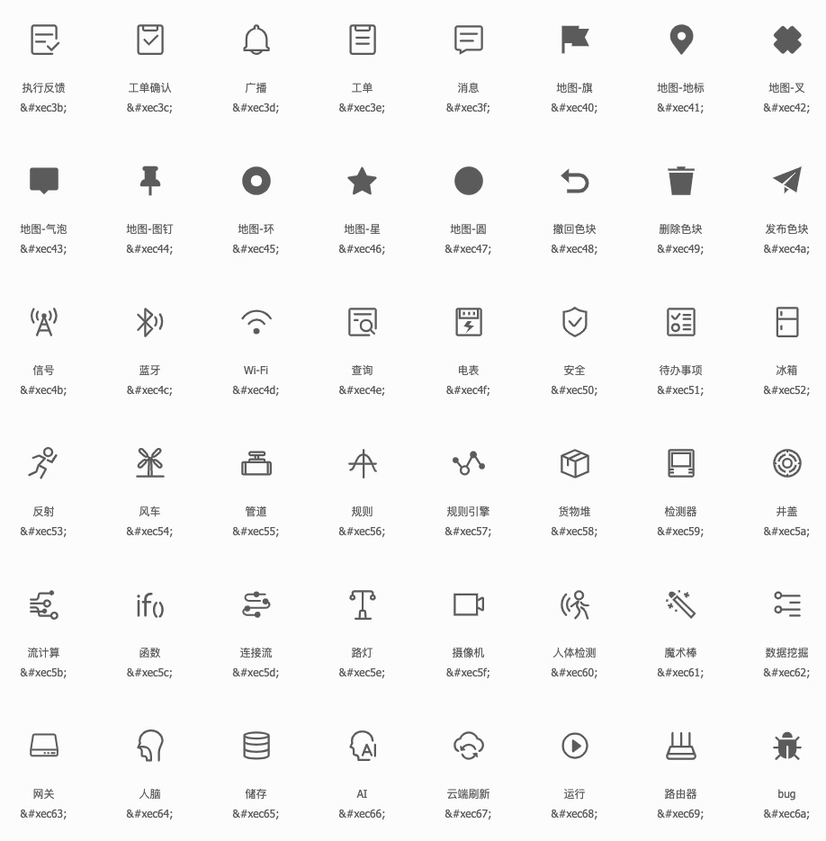
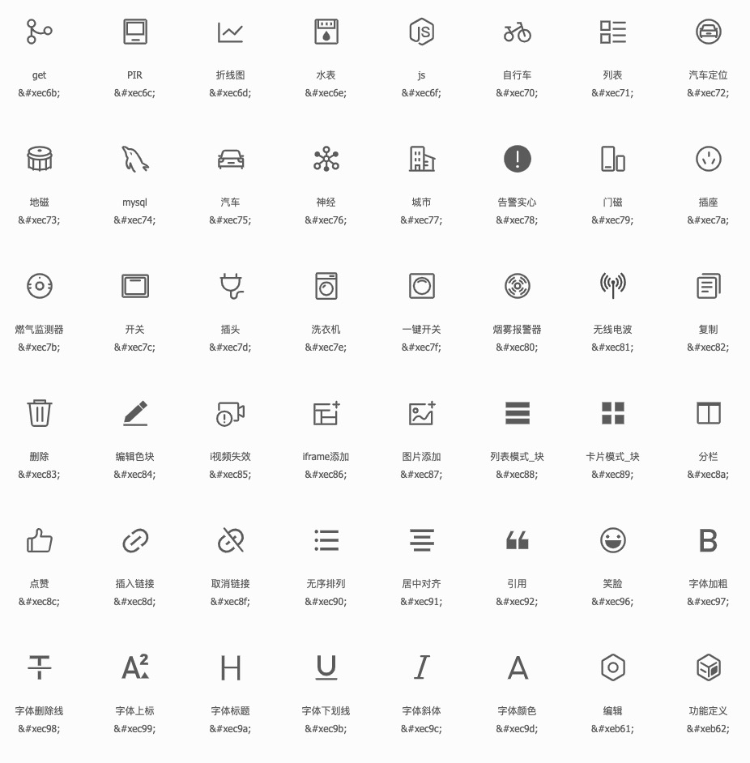
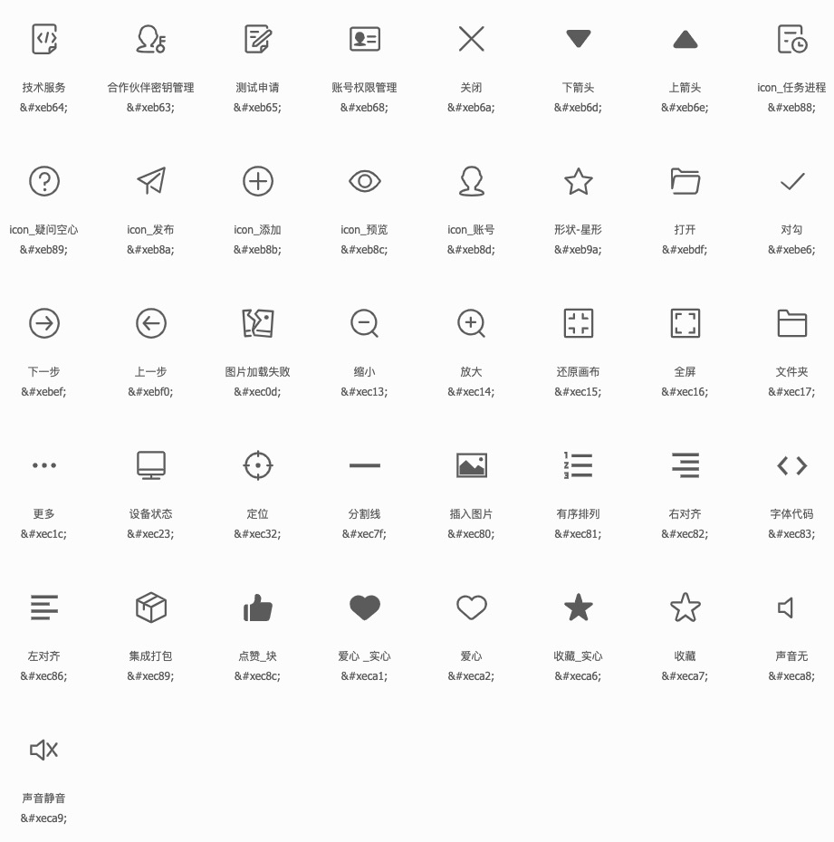
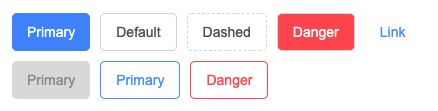

# Icon 图标

**API**

| 属性 | 说明 | 类型 | 默认值 |
| - | - | - | - |
| type | icon样式代码 | String | 无 |
| size | icon样式大小 | Number | 16 |
| color | icon样式颜色 | String | #ccc |

**示例图**

**Icon样式代码**

# Button 按钮

**API**

| 属性 | 说明 | 类型 | 默认值 |
| - | - | - | - |
| type | 按钮类型 | String | 无 |
| disabled | 禁用按钮 | Boolean | false |
| ghost | 背景是否透明化 | Boolean | false |

**示例图**

# Praise 好评

**API**

| 属性 | 说明 | 类型 | 默认值 |
| - | - | - | - |
| quantity | 选中的数量 | Number | 0 |
| size | 图标的大小 | Number | 16 |
| disabled | 禁用按钮 | Boolean | false |

**示例图**

# Empty 空数据

**API**

| 属性 | 说明 | 类型 | 默认值 |
| - | - | - | - |
| title | 文字说明 | String | 'Not Data' |

**示例图**

